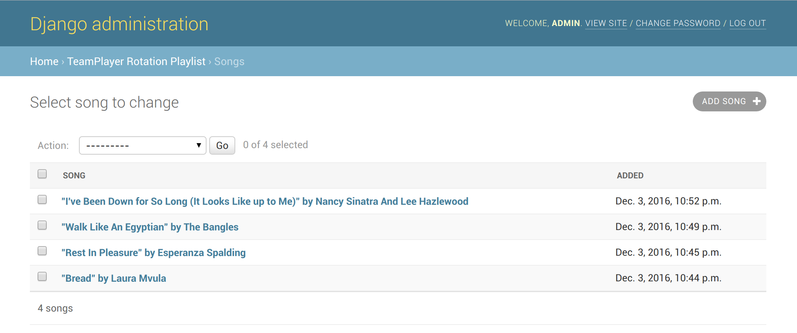

===================
TeamPlayer Rotation
===================

teamplayer-rotation is a autofill plugin for `TeamPlayer`_ that allows a
Django adminstrator to create a playlist of songs from the TeamPlayer library.
This playlist will be used as an autofill strategy so when no players have
queued songs, songs will be played from the playlist.

Installation
------------

Assuming you already have a working instance of TeamPlayer:

1. Install ``teamplayer-rotation``::

    $ pip install git+https://github.com/enku/teamplayer-rotation

2. Change your TeamPlayer settings in your ``DJANGO_SETTINGS_MODULE`` to
   add teamplayer-rotation to ``INSTALLED_APPS``::

    INSTALLED_APPS = [
        ...
        'teamplayer',
        'teamplayer_rotation.apps.TeamplayerRotationConfig',
    ]

3. Change your TeamPlayer settings in your ``DJANGO_SETTINGS_MODULE`` to
   enable and configure teamplayer-rotation::

    TEAMPLAYER = {
        'AUTOFILL_STRATEGY': 'rotation',
        'SHAKE_THINGS_UP': 10',
    }

   The above settings tell TeamPlayer to use the ``rotation`` autofill
   strategyand to fill DJ Ango's queue with 10 songs when prompted.

4. Currently the only way to configure the playlist is through the Django admin
   so be sure to add the Django admin to your configuration.  You should be
   able to add/remove your TeamPlayer library songs to the rotation playlist.

5. Start the spindoctor and DJ Ango will choose songs from the playlist::

    $ python manage.py spindoctor

.. _TeamPlayer: https://github.com/enku/teamplayer
